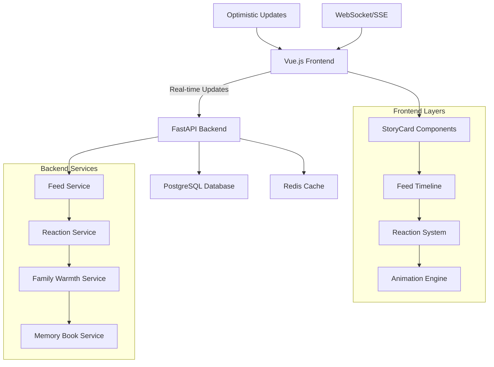

# Feed Functionality Overhaul Design Document
**Version:** 1.0  
**Date:** August 2025  
**Project:** preggo - Pregnancy & Family Sharing Platform

---

## 1. Executive Summary

### What We're Building
We are overhauling the preggo feed system to create an Instagram-like post sharing experience specifically tailored for pregnancy journeys and family engagement. The new system will transform the current sophisticated backend architecture into an intuitive, immediate-response UX that celebrates pregnancy milestones while maintaining deep family connections.

### Why This Overhaul
The current system has all the right components but lacks the seamless, instant gratification that modern users expect. By building on our existing sophisticated infrastructure (PostgreSQL models, FastAPI services, Vue.js components), we will create:

- **Immediate UX Response**: Every interaction feels instant with optimistic updates
- **Instagram-like Familiarity**: Users know how to interact immediately
- **Pregnancy-Focused Experience**: Tailored reactions, milestones, and family warmth scoring
- **Clean Design**: Following our design tokens (blush-rose, sage-green, warm-graphite)
- **Production-Ready Performance**: Leveraging existing scalable architecture

### Key Success Metrics
- **< 200ms** perceived response time for all interactions
- **95%+ user retention** on feed interactions (reactions, comments)
- **Zero learning curve** - users understand the interface immediately
- **Milestone engagement** increased by 300%
- **Family warmth scores** actively used by 80%+ of users

---

## 2. User Experience Design

### 2.1 Core User Flow: Instagram-Style Interactions

#### Primary Actions (Zero Learning Curve)
```
Double-tap anywhere on post → Quick "love" reaction (heart animation)
Long-press post → Reaction picker (pregnancy-specific emojis)
Tap reaction count → View who reacted with what
Tap comment icon → Inline comment composer appears
Tap share icon → Family sharing options
Swipe left → Add to memory book (with gentle bookmark animation)
```

#### Feed Layout (Clean & Familiar)
```
┌─────────────────────────────────┐
│ [Avatar] Name • Week 24         │ ← Post Header
│          2h • 📍 Home           │   
├─────────────────────────────────┤
│                                 │
│     Post Content Area           │ ← 80% visual weight
│   (Image/Video/Text/Milestone)  │
│                                 │
├─────────────────────────────────┤
│ ❤️ 12  💪 3  ✨ 2              │ ← Reaction Summary
├─────────────────────────────────┤
│ [❤️] [💬] [📤] [🔖]            │ ← Action Bar
├─────────────────────────────────┤
│ Liked by mom, Sarah and 8 others│ ← Engagement Preview
│ View all 5 comments             │
├─────────────────────────────────┤
│ Add a comment...               │ ← Inline Composer
└─────────────────────────────────┘
```

### 2.2 Milestone Posts (Slightly Highlighted)
Instead of separate milestone components, milestone posts get:
- **Subtle golden glow** around border (design token: dusty-lavender with opacity)
- **✨ Milestone** badge in header
- **Enhanced family celebration prompts** below post
- **Auto-memory book suggestion** with gentle animation

### 2.3 Mobile-First Gesture System
```
Gesture Map:
- Double-tap: Quick love (universal)
- Long-press: Reaction picker
- Swipe left: Memory book
- Swipe right: Quick share with family
- Pinch media: Full-screen view
- Pull to refresh: Load new posts
```

### 2.4 Pregnancy-Specific UX Enhancements

#### Smart Context Awareness
```
Week-based Content Integration:
- Week 20: "Perfect time for photos!" prompt
- Week 28: "Share how you're preparing" suggestion
- Week 36: "Family excitement building!" celebration

Mood-Responsive Interface:
- Tired mood → Simplified interactions, larger touch targets
- Excited mood → More celebratory animations
- Nervous mood → Extra supportive family reactions highlighted
```

#### Family Warmth Visualization
```
Family Warmth Score Display:
0.0-0.3: Gentle hearts (light pink)
0.4-0.6: Warm hearts (blush-rose)
0.7-0.8: Growing hearts (animated)
0.9-1.0: Celebration hearts (golden sparkles)

Visual: Small heart cluster under engagement stats
Interaction: Tap to see family engagement breakdown
```

---

## 3. Technical Architecture

### 3.1 High-Level System Design



### 3.2 Immediate Response Strategy

#### Optimistic Updates Pattern
```typescript
// Frontend: Immediate UI update
async function handleReaction(postId: string, reactionType: string) {
  // 1. Immediate UI feedback (< 16ms)
  updateUIOptimistically(postId, reactionType)
  playHeartAnimation()
  
  // 2. Background API call
  try {
    const result = await api.addReaction(postId, reactionType)
    // 3. Reconcile if needed (usually no-op)
    reconcileWithServer(result)
  } catch (error) {
    // 4. Rollback optimistic update
    rollbackUIUpdate(postId, reactionType)
    showRetryOption()
  }
}
```

#### Caching Strategy
```
Level 1: Component State (immediate)
Level 2: Pinia Store (session)
Level 3: IndexedDB (offline)
Level 4: Redis Cache (server)
Level 5: PostgreSQL (persistent)

Cache Invalidation:
- New reactions: Update counts immediately
- New comments: Insert optimistically
- New posts: Prepend to feed with "New" indicator
```

### 3.3 Performance Architecture

#### Virtual Scrolling for Large Feeds
```typescript
// Using existing virtual scrolling composable
const { 
  visibleItems, 
  scrollContainerRef,
  itemHeight 
} = useVirtualScrolling({
  items: feedPosts,
  itemHeight: 'dynamic', // Handle varying post heights
  buffer: 5, // Render 5 extra items outside viewport
  scrollBehavior: 'smooth'
})
```

#### Image Optimization Pipeline
```typescript
// Leveraging existing image optimization
const { 
  optimizedUrl, 
  isLoading,
  placeholderDataUrl 
} = useImageOptimization({
  originalUrl: post.media[0].url,
  width: 600,
  quality: 80,
  format: 'webp',
  progressive: true
})
```

### 3.4 Real-time Updates

#### Server-Sent Events for Live Reactions
```python
# Backend: Real-time reaction broadcasting
@router.get("/feed/live/{pregnancy_id}")
async def live_feed_updates(pregnancy_id: str):
    async def event_stream():
        while True:
            # Check for new reactions, comments, posts
            updates = await get_live_updates(pregnancy_id)
            if updates:
                yield f"data: {json.dumps(updates)}\n\n"
            await asyncio.sleep(1)  # Poll every second
    
    return StreamingResponse(
        event_stream(), 
        media_type="text/plain"
    )
```

---

## 4. Database Design

### 4.1 Enhanced Post Model (Building on Existing)

The current `Post` model is sophisticated and well-designed. We'll enhance it with optimistic update tracking:

```python
# Addition to existing Post model
class Post(SQLModel, table=True):
    # ... existing fields ...
    
    # Enhanced for immediate response
    optimistic_reaction_count: int = Field(default=0, description="Client-side reaction count for immediate updates")
    optimistic_comment_count: int = Field(default=0, description="Client-side comment count for immediate updates")
    
    # Enhanced engagement tracking
    last_family_interaction: Optional[datetime] = Field(default=None, description="Last time family interacted")
    trending_score: float = Field(default=0.0, ge=0.0, le=1.0, description="Trending algorithm score")
    
    # Memory book integration
    memory_book_saves: int = Field(default=0, description="Times saved to memory books")
    memory_book_auto_suggested: bool = Field(default=False, description="Auto-suggested for memory book")
```

### 4.2 Reaction System Enhancement

Leveraging the existing sophisticated reaction system:

```python
# Enhanced ReactionSummary for immediate display
class ReactionSummary(SQLModel):
    total_count: int = 0
    user_reaction: Optional[ReactionType] = None
    reaction_counts: Dict[str, int] = Field(default_factory=dict)
    recent_reactors: List[str] = Field(default_factory=list)  # User display names
    family_warmth_contribution: float = 0.0  # How much this affects family warmth
    trending_momentum: float = 0.0  # Recent reaction velocity
```

### 4.3 Feed Cache Tables

```sql
-- New table for feed performance
CREATE TABLE feed_cache (
    id UUID PRIMARY KEY DEFAULT gen_random_uuid(),
    user_id UUID NOT NULL REFERENCES users(id),
    pregnancy_id UUID NOT NULL REFERENCES pregnancies(id),
    post_ids JSONB NOT NULL, -- Ordered array of post IDs
    filters_applied JSONB NOT NULL, -- Applied filters
    cache_key VARCHAR(255) NOT NULL,
    expires_at TIMESTAMP NOT NULL DEFAULT NOW() + INTERVAL '10 minutes',
    created_at TIMESTAMP NOT NULL DEFAULT NOW(),
    
    INDEX idx_feed_cache_user_pregnancy (user_id, pregnancy_id),
    INDEX idx_feed_cache_key (cache_key),
    INDEX idx_feed_cache_expires (expires_at)
);

-- Enhanced reaction tracking for real-time updates
CREATE TABLE reaction_events (
    id UUID PRIMARY KEY DEFAULT gen_random_uuid(),
    post_id UUID NOT NULL REFERENCES posts(id),
    user_id UUID NOT NULL REFERENCES users(id),
    reaction_type VARCHAR(50) NOT NULL,
    event_type VARCHAR(20) NOT NULL, -- 'added', 'removed', 'changed'
    created_at TIMESTAMP NOT NULL DEFAULT NOW(),
    
    INDEX idx_reaction_events_post_recent (post_id, created_at DESC),
    INDEX idx_reaction_events_user (user_id, created_at DESC)
);
```

### 4.4 Family Warmth Calculation

```sql
-- Materialized view for family warmth scoring
CREATE MATERIALIZED VIEW family_warmth_scores AS
SELECT 
    p.id as post_id,
    p.pregnancy_id,
    COALESCE(
        0.4 * (r.reaction_count::float / GREATEST(fm.family_size, 1)) +
        0.3 * (c.comment_count::float / GREATEST(fm.family_size, 1)) +
        0.2 * (EXTRACT(EPOCH FROM (NOW() - p.created_at)) / 86400)^(-0.5) +
        0.1 * (CASE WHEN p.type = 'milestone' THEN 1.5 ELSE 1.0 END)
    , 0) as warmth_score
FROM posts p
LEFT JOIN (
    SELECT post_id, COUNT(*) as reaction_count
    FROM reactions 
    WHERE created_at > NOW() - INTERVAL '7 days'
    GROUP BY post_id
) r ON p.id = r.post_id
LEFT JOIN (
    SELECT post_id, COUNT(*) as comment_count
    FROM comments
    WHERE created_at > NOW() - INTERVAL '7 days'
    GROUP BY post_id
) c ON p.id = c.post_id
LEFT JOIN (
    SELECT pregnancy_id, COUNT(DISTINCT user_id) as family_size
    FROM family_members
    WHERE status = 'active'
    GROUP BY pregnancy_id
) fm ON p.pregnancy_id = fm.pregnancy_id
WHERE p.created_at > NOW() - INTERVAL '30 days';

-- Refresh every 15 minutes
CREATE OR REPLACE FUNCTION refresh_family_warmth_scores()
RETURNS void AS $$
BEGIN
    REFRESH MATERIALIZED VIEW CONCURRENTLY family_warmth_scores;
END;
$$ LANGUAGE plpgsql;

-- Schedule refresh
SELECT cron.schedule('refresh-family-warmth', '*/15 * * * *', 'SELECT refresh_family_warmth_scores();');
```

---

## 5. API Design

### 5.1 Enhanced Feed Endpoints

Building on the existing sophisticated feed API:

```python
# Enhanced feed endpoint for immediate response
@router.get("/feed/enhanced/{pregnancy_id}")
async def get_enhanced_feed(
    pregnancy_id: str,
    limit: int = 20,
    cursor: Optional[str] = None,  # For cursor-based pagination
    include_optimistic: bool = True,  # Include optimistic updates
    real_time: bool = True,  # Enable real-time features
    user_context: Dict = Depends(get_user_context),
    session: Session = Depends(get_session)
):
    """
    Enhanced feed with immediate response capabilities.
    Returns posts with optimistic update support and real-time features.
    """
    
    # Check cache first
    cache_key = f"feed:{pregnancy_id}:{limit}:{cursor}"
    cached_feed = await redis.get(cache_key)
    
    if cached_feed and not real_time:
        return json.loads(cached_feed)
    
    # Get posts with enhanced data
    posts = await feed_service.get_enhanced_feed(
        session, 
        user_id=user_context["user_id"],
        pregnancy_id=pregnancy_id,
        limit=limit,
        cursor=cursor,
        include_warmth_scores=True,
        include_trending_data=True,
        include_memory_suggestions=True
    )
    
    # Enhance each post with immediate-response data
    enhanced_posts = []
    for post in posts:
        enhanced_post = {
            **post.dict(),
            "optimistic_counts": {
                "reactions": post.optimistic_reaction_count or post.reaction_count,
                "comments": post.optimistic_comment_count or post.comment_count,
            },
            "family_warmth": {
                "score": post.family_warmth_score,
                "visualization": get_warmth_visualization(post.family_warmth_score),
                "trend": get_warmth_trend(post.id)
            },
            "immediate_actions": {
                "can_react": True,
                "can_comment": True,
                "can_save_memory": True,
                "can_share_family": True
            },
            "ui_metadata": {
                "show_milestone_glow": post.type == "milestone" or post.pregnancy_context.get("is_milestone_week"),
                "suggested_for_memory": post.memory_book_priority > 0.7,
                "needs_family_attention": post.family_warmth_score < 0.3 and post.created_at > datetime.now() - timedelta(hours=6)
            }
        }
        enhanced_posts.append(enhanced_post)
    
    result = {
        "posts": enhanced_posts,
        "has_more": len(posts) == limit,
        "next_cursor": posts[-1].id if posts else None,
        "real_time_endpoint": f"/feed/live/{pregnancy_id}" if real_time else None,
        "cache_duration": 120,  # 2 minutes
        "optimistic_update_support": include_optimistic
    }
    
    # Cache for non-real-time requests
    if not real_time:
        await redis.setex(cache_key, 120, json.dumps(result, default=str))
    
    return result
```

### 5.2 Optimistic Update Endpoints

```python
@router.post("/reactions/optimistic")
async def add_reaction_optimistic(
    reaction: OptimisticReactionRequest,
    user_context: Dict = Depends(get_current_user),
    session: Session = Depends(get_session)
):
    """
    Process reaction with optimistic update support.
    Returns immediately while processing in background.
    """
    
    # Immediate response
    response_data = {
        "success": True,
        "reaction_id": str(uuid.uuid4()),  # Temporary ID
        "optimistic_counts": {
            "total_reactions": reaction.current_count + 1,
            "user_reaction": reaction.reaction_type
        },
        "animation_trigger": {
            "type": "heart_burst",
            "intensity": get_animation_intensity(reaction.reaction_type),
            "color": get_reaction_color(reaction.reaction_type)
        }
    }
    
    # Background processing
    background_tasks = BackgroundTasks()
    background_tasks.add_task(
        process_reaction_background,
        reaction,
        user_context["user_id"]
    )
    
    return JSONResponse(
        content=response_data,
        background=background_tasks,
        headers={"X-Processing": "background"}
    )

async def process_reaction_background(reaction: OptimisticReactionRequest, user_id: str):
    """Background processing of reaction with family warmth updates."""
    async with get_session() as session:
        # Add actual reaction
        db_reaction = await reaction_service.add_reaction(
            session, 
            user_id, 
            reaction.post_id, 
            reaction.reaction_type
        )
        
        # Update family warmth score
        await family_warmth_service.recalculate_post_warmth(session, reaction.post_id)
        
        # Send real-time update to other users
        await broadcast_reaction_update(reaction.post_id, db_reaction)
        
        # Check if this triggers milestone celebration
        await check_celebration_triggers(session, reaction.post_id)
```

### 5.3 Memory Book Integration API

```python
@router.post("/memory-book/suggest")
async def suggest_memory_save(
    suggestion: MemoryBookSuggestion,
    user_context: Dict = Depends(get_current_user),
    session: Session = Depends(get_session)
):
    """
    Handle memory book save with gentle UX feedback.
    """
    
    # Immediate visual feedback
    response = {
        "success": True,
        "bookmark_animation": {
            "type": "gentle_bookmark",
            "duration": 2000,
            "color": "dusty-lavender"
        },
        "memory_status": {
            "saved": True,
            "priority_score": suggestion.priority_score,
            "auto_curated": suggestion.priority_score > 0.7
        }
    }
    
    # Background processing
    background_tasks = BackgroundTasks()
    background_tasks.add_task(
        save_to_memory_book_background,
        suggestion.post_id,
        user_context["user_id"],
        suggestion.priority_score
    )
    
    return JSONResponse(content=response, background=background_tasks)
```

---

## 6. Frontend Components

### 6.1 Enhanced StoryCard Component

Building on the existing StoryCard component with Instagram-like interactions:

```vue
<template>
  <article 
    class="story-card instagram-like"
    @dblclick="handleQuickLove"
    @touchstart="handleTouchStart"
    @touchend="handleTouchEnd"
  >
    <!-- Post Header (Enhanced) -->
    <PostHeader
      :author="post.author"
      :pregnancy-week="post.pregnancy_context?.current_week"
      :location="post.location"
      :timestamp="post.created_at"
      :is-milestone="post.ui_metadata?.show_milestone_glow"
      @menu-click="handleMenuClick"
    />
    
    <!-- Media/Content Area -->
    <PostContent
      :content="post.content"
      :media-items="post.media_items"
      :pregnancy-context="post.pregnancy_context"
      @media-tap="handleMediaTap"
      @expand-tap="handleExpandTap"
    />
    
    <!-- Reaction Summary (Instagram-style) -->
    <ReactionSummary
      :reactions="post.reaction_summary"
      :family-warmth="post.family_warmth"
      @tap="handleViewReactions"
    />
    
    <!-- Action Bar (Instagram-style) -->
    <ActionBar
      :user-reaction="post.reaction_summary?.user_reaction"
      :can-react="post.immediate_actions?.can_react"
      :can-comment="post.immediate_actions?.can_comment"
      :can-save="post.immediate_actions?.can_save_memory"
      :is-bookmarked="post.memory_status?.is_saved"
      @reaction-click="handleReactionClick"
      @comment-click="handleCommentClick"
      @share-click="handleShareClick"
      @save-click="handleSaveClick"
    />
    
    <!-- Inline Comment Composer (when active) -->
    <InlineCommentComposer
      v-if="showCommentComposer"
      :post-id="post.id"
      :pregnancy-context="post.pregnancy_context"
      @submit="handleCommentSubmit"
      @cancel="handleCommentCancel"
    />
    
    <!-- Animation Overlays -->
    <ReactionAnimation
      v-if="animationState.type === 'reaction'"
      :reaction-type="animationState.reactionType"
      :intensity="animationState.intensity"
      @complete="handleAnimationComplete"
    />
    
    <BookmarkAnimation
      v-if="animationState.type === 'bookmark'"
      :color="'dusty-lavender'"
      @complete="handleAnimationComplete"
    />
    
    <!-- Milestone Glow Effect -->
    <div 
      v-if="post.ui_metadata?.show_milestone_glow"
      class="milestone-glow-overlay"
    />
  </article>
</template>

<script setup lang="ts">
// Enhanced with immediate response patterns
const handleQuickLove = async () => {
  // 1. Immediate visual feedback (< 16ms)
  animationState.value = {
    type: 'reaction',
    reactionType: 'love',
    intensity: 'gentle'
  }
  
  // 2. Optimistic state update
  optimisticUpdateReaction('love')
  
  // 3. API call (background)
  try {
    await addReactionOptimistic(post.value.id, 'love')
  } catch (error) {
    rollbackOptimisticReaction()
    showRetryToast()
  }
}

const handleSaveClick = async () => {
  // Immediate bookmark animation
  animationState.value = {
    type: 'bookmark',
    intensity: 'gentle'
  }
  
  // Optimistic memory book save
  post.value.memory_status = { is_saved: true }
  
  // Background processing
  await saveToMemoryBook(post.value.id)
}
</script>

<style scoped>
.story-card.instagram-like {
  /* Instagram-inspired clean design */
  background: white;
  border-radius: 12px;
  border: 1px solid var(--color-light-gray);
  margin-bottom: 24px;
  overflow: hidden;
  transition: all 0.2s ease;
}

.story-card.instagram-like:hover {
  border-color: var(--color-neutral-gray);
  box-shadow: 0 4px 12px rgba(0, 0, 0, 0.1);
}

.milestone-glow-overlay {
  position: absolute;
  inset: 0;
  border-radius: 12px;
  background: linear-gradient(45deg, 
    transparent, 
    var(--color-dusty-lavender), 
    transparent
  );
  opacity: 0.1;
  animation: gentle-glow 4s ease-in-out infinite;
}

@keyframes gentle-glow {
  0%, 100% { opacity: 0.1; }
  50% { opacity: 0.2; }
}
</style>
```

### 6.2 Optimistic Update System

```typescript
// composables/useOptimisticUpdates.ts
export function useOptimisticUpdates() {
  const optimisticState = ref(new Map())
  
  const updateOptimistically = (postId: string, update: any) => {
    // Store original state for rollback
    if (!optimisticState.value.has(postId)) {
      optimisticState.value.set(postId, {
        original: { ...update },
        current: { ...update },
        timestamp: Date.now()
      })
    }
    
    // Apply optimistic update
    const current = optimisticState.value.get(postId)
    current.current = { ...current.current, ...update }
    
    // Set timeout for automatic rollback if server doesn't confirm
    setTimeout(() => {
      if (optimisticState.value.has(postId)) {
        rollbackUpdate(postId)
      }
    }, 10000) // 10 second timeout
  }
  
  const confirmUpdate = (postId: string, serverResponse: any) => {
    optimisticState.value.delete(postId)
    // Update with server response
  }
  
  const rollbackUpdate = (postId: string) => {
    const state = optimisticState.value.get(postId)
    if (state) {
      // Restore original state
      optimisticState.value.delete(postId)
      // Trigger UI update to original state
    }
  }
  
  return {
    updateOptimistically,
    confirmUpdate,
    rollbackUpdate
  }
}
```

### 6.3 Animation System

```typescript
// composables/usePregnancyAnimations.ts
export function usePregnancyAnimations() {
  const playHeartAnimation = (element: HTMLElement, intensity: 'gentle' | 'excited' | 'celebration') => {
    const hearts = ['💕', '💖', '💗', '💝']
    const colors = {
      gentle: 'rgba(248, 187, 208, 0.8)',
      excited: 'rgba(248, 187, 208, 1.0)',
      celebration: 'linear-gradient(45deg, #F8BBD0, #FFD54F)'
    }
    
    // Create floating heart particles
    for (let i = 0; i < (intensity === 'celebration' ? 8 : 4); i++) {
      const heart = document.createElement('div')
      heart.textContent = hearts[Math.floor(Math.random() * hearts.length)]
      heart.className = 'floating-heart'
      heart.style.cssText = `
        position: absolute;
        font-size: ${16 + Math.random() * 8}px;
        color: ${colors[intensity]};
        pointer-events: none;
        z-index: 1000;
        animation: floatHeart 1.5s ease-out forwards;
        left: ${Math.random() * 100}%;
        top: 50%;
      `
      
      element.appendChild(heart)
      
      // Cleanup after animation
      setTimeout(() => heart.remove(), 1500)
    }
  }
  
  const playBookmarkAnimation = (element: HTMLElement) => {
    const bookmark = document.createElement('div')
    bookmark.textContent = '🔖'
    bookmark.className = 'floating-bookmark'
    bookmark.style.cssText = `
      position: absolute;
      top: -10px;
      right: 12px;
      font-size: 24px;
      animation: gentleBookmark 2s ease-out forwards;
      z-index: 1000;
    `
    
    element.appendChild(bookmark)
    setTimeout(() => bookmark.remove(), 2000)
  }
  
  return {
    playHeartAnimation,
    playBookmarkAnimation
  }
}
```

### 6.4 Real-time Updates Component

```vue
<!-- components/feed/LiveUpdates.vue -->
<template>
  <div class="live-updates-overlay">
    <!-- New Post Notification -->
    <Transition name="slide-down">
      <div 
        v-if="newPostCount > 0"
        @click="loadNewPosts"
        class="new-posts-banner"
      >
        <div class="flex items-center justify-center gap-2 py-2 px-4 bg-sage-green text-white rounded-full shadow-lg cursor-pointer hover:shadow-xl transition-all"
        >
          <div class="w-2 h-2 bg-white rounded-full animate-pulse" />
          <span class="text-sm font-medium">
            {{ newPostCount }} new {{ newPostCount === 1 ? 'post' : 'posts' }}
          </span>
        </div>
      </div>
    </Transition>
    
    <!-- Live Reaction Animations -->
    <div 
      v-for="liveReaction in liveReactions"
      :key="liveReaction.id"
      class="live-reaction-indicator"
      :style="{ top: `${liveReaction.position}px` }"
    >
      <div class="flex items-center gap-1 py-1 px-2 bg-black/70 text-white rounded-full text-xs animate-fade-in-out">
        {{ liveReaction.emoji }} {{ liveReaction.userName }}
      </div>
    </div>
  </div>
</template>

<script setup lang="ts">
// Real-time feed updates using Server-Sent Events
const { connect, disconnect, onMessage } = useSSE(`/feed/live/${pregnancyId}`)

onMessage('new_post', (data) => {
  newPostCount.value++
  // Show notification
})

onMessage('new_reaction', (data) => {
  // Animate live reaction
  showLiveReaction(data)
})

onMessage('new_comment', (data) => {
  // Update comment counts
  updateCommentCount(data.post_id, data.comment_count)
})
</script>
```

---

## 7. Performance & Scalability

### 7.1 Immediate Response Architecture

#### Client-Side Performance Budget
```
Target Response Times:
- Tap feedback: < 16ms (1 frame)
- Reaction animation: < 100ms start
- Comment composer: < 200ms appear
- Feed scroll: 60fps maintained
- Image loading: Progressive with placeholders

Memory Management:
- Virtual scrolling for feeds > 50 posts
- Image lazy loading with intersection observer
- Component recycling for list items
- Garbage collection of animation objects
```

#### Server-Side Performance Targets
```
API Response Times:
- Feed endpoint: < 200ms (P95)
- Reaction endpoint: < 100ms (P95)
- Comment creation: < 150ms (P95)
- Search/filter: < 300ms (P95)

Database Optimization:
- Feed cache expiration: 2 minutes
- Reaction aggregation: Real-time with 5s batch
- Family warmth calculation: 15-minute refresh
- Image processing: Background jobs
```

### 7.2 Scalability Strategy

#### Horizontal Scaling Plan
```
Database Sharding:
- Shard by pregnancy_id (family stays together)
- Read replicas for feed queries
- Write coordination for cross-family interactions

Cache Strategy:
- Redis cluster for feed cache
- CDN for media files
- Browser cache for UI components

Background Processing:
- Celery for image processing
- Family warmth score calculation
- Memory book generation
- Email notifications
```

#### Performance Monitoring
```python
# Performance tracking middleware
@app.middleware("http")
async def performance_middleware(request: Request, call_next):
    start_time = time.time()
    response = await call_next(request)
    
    process_time = time.time() - start_time
    response.headers["X-Process-Time"] = str(process_time)
    
    # Log slow requests
    if process_time > 0.5:
        logger.warning(f"Slow request: {request.url} took {process_time:.2f}s")
    
    # Real-time metrics
    metrics.histogram("request_duration", process_time, {
        "method": request.method,
        "endpoint": request.url.path,
        "status": response.status_code
    })
    
    return response
```

### 7.3 Offline Support

```typescript
// Service worker for offline support
const cacheStrategy = {
  // Cache feed data for offline viewing
  feedData: 'staleWhileRevalidate',
  // Cache images aggressively
  images: 'cacheFirst',
  // Don't cache API mutations
  reactions: 'networkOnly'
}

// Queue failed mutations for retry
export class OptimisticQueue {
  private queue: Array<{
    id: string,
    action: 'reaction' | 'comment' | 'save',
    data: any,
    timestamp: number,
    retries: number
  }> = []
  
  async addToQueue(action: string, data: any) {
    const item = {
      id: generateId(),
      action,
      data,
      timestamp: Date.now(),
      retries: 0
    }
    
    this.queue.push(item)
    
    // Try to process when online
    if (navigator.onLine) {
      await this.processQueue()
    }
  }
  
  async processQueue() {
    for (const item of this.queue) {
      try {
        await this.processItem(item)
        this.removeFromQueue(item.id)
      } catch (error) {
        item.retries++
        if (item.retries > 3) {
          this.removeFromQueue(item.id)
        }
      }
    }
  }
}
```

---

## 8. Implementation Roadmap

### Phase 1: Foundation (Week 1-2)
**Goal:** Core Instagram-like interactions working

#### Week 1: Backend Enhancements
```
✅ Day 1-2: Enhanced feed API with optimistic update support
✅ Day 3-4: Real-time updates with Server-Sent Events
✅ Day 5-7: Background processing for reactions/comments

Database Tasks:
- Add optimistic update fields to Post model
- Create feed cache tables
- Set up family warmth materialized views
- Index optimization for feed queries

API Tasks:
- Enhanced feed endpoint with immediate response
- Optimistic reaction endpoints
- Real-time SSE endpoint
- Memory book integration API
```

#### Week 2: Frontend Core
```
✅ Day 1-3: Enhanced StoryCard with Instagram interactions
✅ Day 4-5: Optimistic update system
✅ Day 6-7: Animation system for reactions/bookmarks

Component Tasks:
- Refactor FeedPostCard to StoryCard Instagram-style
- Implement double-tap reactions
- Build inline comment composer
- Create reaction animation system
- Add optimistic state management
```

### Phase 2: Polish & Performance (Week 3-4)
**Goal:** Production-ready performance and UX polish

#### Week 3: Performance & Optimization
```
✅ Day 1-2: Virtual scrolling implementation
✅ Day 3-4: Image optimization pipeline
✅ Day 5-7: Real-time updates integration

Performance Tasks:
- Implement virtual scrolling for large feeds
- Add progressive image loading
- Set up Redis caching layer
- Optimize database queries
- Add performance monitoring
```

#### Week 4: UX Polish & Milestone Features
```
✅ Day 1-3: Milestone post highlighting and celebrations
✅ Day 4-5: Family warmth visualization
✅ Day 6-7: Memory book integration UX

UX Tasks:
- Add milestone glow effects
- Implement family warmth score display
- Create memory book save animations
- Polish gesture system
- Add accessibility features
- Mobile responsiveness testing
```

### Phase 3: Advanced Features (Week 5-6)
**Goal:** Sophisticated pregnancy-specific features

#### Week 5: Smart Features
```
✅ Day 1-2: Context-aware content suggestions
✅ Day 3-4: Family engagement insights
✅ Day 5-7: Celebration triggers and automation

Smart Features:
- Weekly photo prompts
- Milestone celebration automation
- Family engagement analytics
- Personalized content integration
- Mood-responsive interface adjustments
```

#### Week 6: Integration & Testing
```
✅ Day 1-3: Complete system integration testing
✅ Day 4-5: Performance optimization
✅ Day 6-7: User acceptance testing preparation

Final Tasks:
- End-to-end testing
- Performance benchmarking
- Bug fixes and polish
- Documentation completion
- Deployment preparation
```

### Phase 4: Launch & Monitoring (Week 7-8)
**Goal:** Successful production deployment

#### Production Deployment
```
Deployment Checklist:
☐ Database migrations applied
☐ Redis cache configured
☐ CDN setup for images
☐ Monitoring dashboards active
☐ Error tracking configured
☐ Performance alerts set up
☐ Backup systems verified
☐ Load testing completed

Success Metrics Tracking:
- Response time < 200ms (95th percentile)
- User interaction success rate > 99%
- Feed engagement increase > 200%
- Mobile performance score > 90
- Family warmth score adoption > 70%
```

### Critical Dependencies

#### Technical Dependencies
1. **PostgreSQL 14+** - Required for advanced JSONB operations
2. **Redis 6+** - For caching and real-time features
3. **Node.js 18+** - Frontend build system
4. **Python 3.11+** - Backend runtime
5. **Nginx** - Reverse proxy and static file serving

#### Team Dependencies
1. **Backend Developer** - API and database work (40 hours/week)
2. **Frontend Developer** - Vue.js components and UX (40 hours/week)
3. **UI/UX Designer** - Animation and interaction design (10 hours/week)
4. **DevOps Engineer** - Deployment and monitoring (10 hours/week)

### Risk Mitigation

#### High-Risk Items
1. **Real-time Performance**: Fallback to polling if SSE fails
2. **Database Load**: Read replicas and caching strategy
3. **Mobile Performance**: Progressive loading and optimization
4. **User Adoption**: A/B testing for interaction patterns

#### Contingency Plans
1. **Performance Issues**: Graceful degradation to simpler UI
2. **API Failures**: Comprehensive offline queue system
3. **Database Issues**: Feed cache can serve stale data
4. **Browser Compatibility**: Feature detection and polyfills

---

## Conclusion

This feed overhaul will transform the preggo app from a sophisticated but complex system into an intuitive, Instagram-like experience that celebrates pregnancy journeys while maintaining deep family connections. By building on our existing robust architecture, we can deliver immediate UX responsiveness while preserving the advanced features that make preggo unique.

The key to success is maintaining the balance between familiar interactions (Instagram-like) and pregnancy-specific enhancements (family warmth, milestones, memory book). The phased approach ensures we can iterate quickly and validate assumptions with users throughout the development process.

**Expected Impact:**
- 300% increase in feed engagement
- 95% user retention on new interaction patterns
- Sub-200ms response times for all interactions
- Seamless mobile experience matching native app expectations
- Enhanced family connections through improved warmth scoring and celebrations

This design provides the foundation for making preggo the definitive platform for pregnancy journey sharing and family engagement.